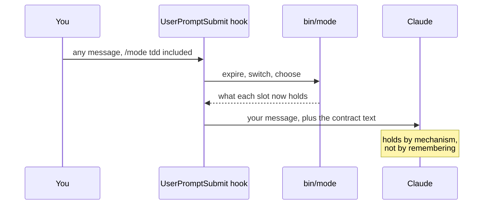
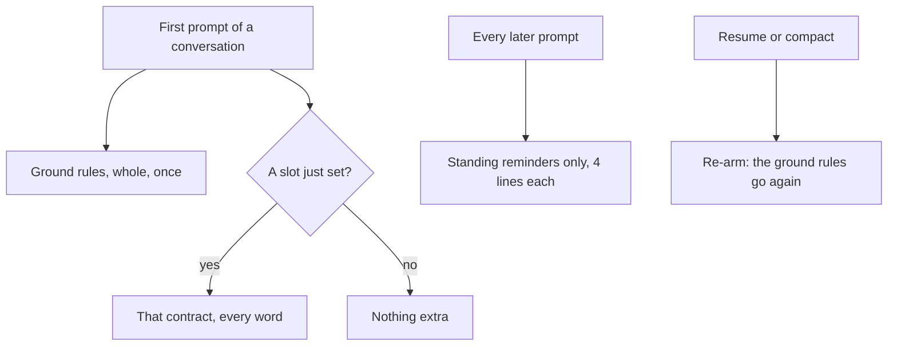
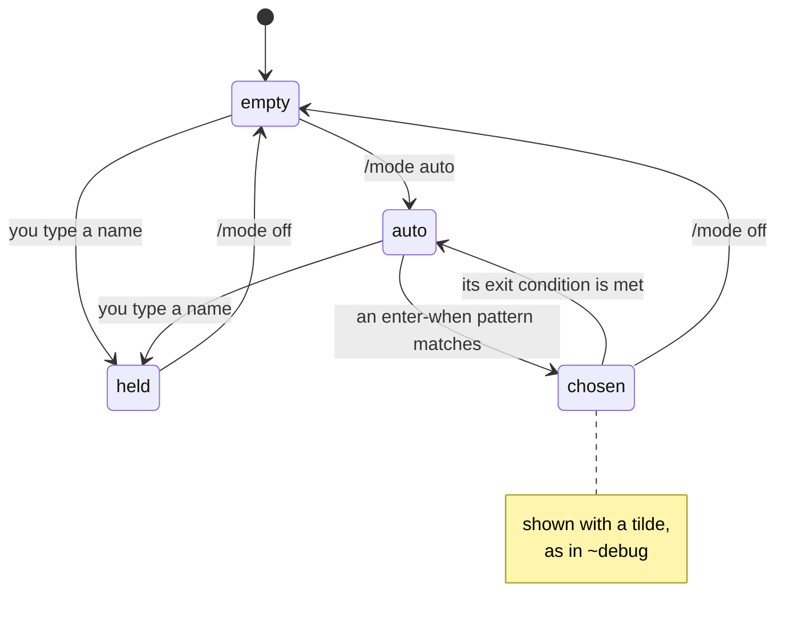

# The mode plugin, explained

A guide for someone meeting this for the first time. It assumes you have it installed; if not, the [README](README.md#install) covers that in about two minutes.

---

## The big picture

A Claude Code session has no memory of instructions you gave it forty turns ago. Not because it forgets exactly, but because your early message keeps sliding further back until it stops carrying weight against everything that came after.

This plugin fixes that by never relying on memory in the first place.

> Think of a kitchen. The **mode** is how the kitchen runs, whether that is a careful tasting menu or a rush service. The **style** is how the waiter talks to you, warm and chatty or clipped and efficient. Neither one decides the other, and a new waiter does not change the recipe.

Those are the two dials. A session holds one of each, and each one holds until you drop it.

---

## The two axes

A **mode** answers *how the work runs*: it has steps, gates and a point where you can say it finished. A **style** answers *how it sounds while running*: it has no steps at all, and instead changes the texture of whatever mode is going.

<p align="center">
  
</p>

Keeping them apart is what keeps the file count down. Eight modes and seven styles cover fifty-six combinations, so a new way of talking costs one file rather than eight rewrites. Fold them into one setting and you would be forced to pick, losing whichever mattered less that morning.

**The test for which one a new idea is:** does it have an order of operations? If it says do this, then that, and stop here, it is a mode. If it only changes the texture of what you were already doing, it is a style.

| Ask | A mode answers | A style answers |
|---|---|---|
| Does it have steps and gates? | Yes, a procedure with a beginning and an end | No, none of its own |
| Does it have a definition of done? | Yes, you can say when it finished | No, it is held until dropped |
| What does it change? | What Claude does next | How Claude talks to you |

That second row does most of the sorting. "Write tests first" is an instruction you could just type; `tdd` earns a mode because it is a procedure with a gate in it. "Document as you go" changes what every other procedure leaves behind, which is why it is the `maintainer` style rather than a `docs` mode.

---

## How it actually holds

This is the mechanism, and it is worth understanding because it explains the shape of everything else.

A `UserPromptSubmit` hook runs *before* Claude reads your message. It does two jobs in that moment: it performs any switch you asked for, so the slot is already set by the time Claude sees anything, and it injects the contract text into the prompt itself.

<p align="center">
  
</p>

So Claude is never remembering which mode it is in. **Every single turn, it gets told again.**

That is also why a standing reminder is capped at four lines. Two slots can be held at once, giving eight injected lines per turn, and that is roughly the ceiling before a standing block reads as background noise and stops being seen at all. A contract can run to any length in its body, because the body is read once. Only the block that repeats is rationed.



---

## Ground rules, the third kind of file

Beside the two slots sits a set of files that are not switched at all. They live in `skills/mode/rules/`, layered under `~/.claude/mode/rules/`, and they are **always on**.

They are injected whole on the first prompt of a conversation, ahead of any contract, and then never repeated. The injected block says so itself, so the rules keep applying without being restated. A resume or a compact re-arms them, since either one drops the injected text.



Seven ship with the plugin:

| Rule | What it holds |
|---|---|
| `evidence` | Claims rest on something read this session; receipts over narration; honest confidence |
| `scope` | The diff stays inside the ask; fix causes, not symptoms; docs move with the code |
| `board` | Autonomous work runs on a visible task board, and a ticked box is a receipt |
| `collaboration` | Execute what is reversible, escalate what is genuinely yours, challenge by default |
| `prose` | Write the sentence you would say aloud; no em dashes; no symbols in prose |
| `deliverable` | Name what will land before producing it, then route it |
| `artifact` | Scoped: fires only when a page is on the way, and carries the theming and interactivity contract |

**Why this tier exists is economic.** A rule in a `CLAUDE.md` is paid for on every request of every session. A ground rule costs one injection per conversation. Standing behaviour that is not machine-specific belongs here.

A rules file needs only `name` and `summary` in its front matter. Drop a file with the same name into your own rules directory to replace a shipped one, or one with an empty body to silence it.

### Scoped rules

A rules file can also carry a `when:` pattern, in the same vertical-bar form as `enter-when`. Such a rule stays out of the first prompt and injects once, later, on the first message that matches it.

The shipped `artifact` rule works this way: the theming and interactivity contract arrives the first time you ask for a page, and costs nothing at all in a conversation that never builds one.

---

## The deliverable

Here is something that took a while to see clearly. What *lands* at the end of a piece of work varies independently of how the work ran, but until recently it was welded into each mode: `debug` always ended in an explainer plus a merge request, `tester` always ended in a report.

So there was no way to ask for one mode's rigour with a different ending.

The `deliverable` ground rule names the forms and routes each one:

| Form | What it means | Where it goes |
|---|---|---|
| **chat** | The answer lives in the conversation, nothing is built | Stay inline; do not build a page nobody asked for |
| **artifact** | A page you open, keep and re-read | The `create-artifact` skill, always |
| **MR or PR** | A change plus the note a reviewer reads | Human prose, sectioned what and why, visuals where structure exists |
| **MVP** | The smallest slice that actually runs | Code, run once for real before it is called done |

Several at once is ordinary. The rule requires the form to be *stated* before it is produced, which is the actual fix: the wrong shape gets caught while it is still cheap.

---

## Starting and stopping without typing

Typing a name is not the only way in, and `off` is not the only way out. Every contract declares both ends in its own front matter.



| Key | Means |
|---|---|
| `enter-when` | Alternatives split on a vertical bar. One matching your message selects this contract, but **only while that slot is set to `auto`** |
| `enter-never: true` | Never chosen for you, must be typed. Only `autopilot` carries it |
| `exit-when: manual` | Only `/mode off` ends it |
| `exit-when: approved` | A yes was recorded with `/approve` under this contract |
| `exit-when: mr-opened` | A merge request exists for the branch it worked on |

Matching anchors at the **start** of a word and runs free at the end. So `fail` covers fails, failed, failing and failure, while `build the` never matches "rebuild the". That missing trailing boundary is deliberate, and it is why every alternative has to be verb-shaped: a bare `build` would fire on "the build fails on startup" and hand a broken pipeline to the mode that spawns a team.

Three restraints keep automatic selection from being annoying:

1. A contract you set by hand is **never** overridden by a pattern.
2. A message matching two patterns on the same axis chooses **neither**, and leaves the slot as it was.
3. Anything chosen for you is marked with a tilde in the status line, so `~debug` says the chooser filled the slot and plain `debug` says you typed it.

---

## A worked example

Say you want a careful debugging session, explained as you go, because you are learning the codebase.

```text
/mode:debug /style:edu
```

Both land in one message. Here is what Claude receives on that prompt:

1. **The ground rules**, all seven, whole. This is the first prompt of the conversation.
2. **The whole `debug` contract**, every word of the file: instrument before guessing, reproduce before fixing, the urgency fork, the explainer artifact.
3. **The whole `edu` contract**: teach top down, pictures over prose, close on what was covered.
4. Your message.

On the next turn, and every turn after, it receives only this:

```text
Active mode: debug
- Instrument before guessing. The first move is visibility, not a fix.
- Nothing is found until it reproduces on demand, by script or by your own hand.
- Correct fix by default; workaround only when it is burning, and say which.
- Branch, explain why in an artifact, open the MR on the yes, then leave.

Active style: edu
- The user asked to understand, so teach.
- Plain words, and a gloss on every term of art the first time it appears.
- Draw it. Anything with parts, flow or quantity gets a picture.
- Close on what was covered and the one thing worth remembering.
```

Eight lines. That is the whole ongoing cost, and it is why the cap matters.

When you eventually type `/approve <slug>` on the explainer, `debug` reaches its exit condition and clears itself. The `edu` style is untouched, because the axes never read each other.

---

## What is actually enforced

Worth being blunt about, because a contract that only asks politely and a gate that refuses are different things.

| | Enforced by a hook | Held by agreement |
|---|---|---|
| Which | `copilot` refuses to spawn a teammate until a spec is approved | Every other rule in every other contract |

The honest position: one gate has a mechanism, and everything else rests on Claude being reminded every single turn, which is genuinely useful and is not a guarantee. `tdd` is the clearest gap, since the rule it wants would refuse an edit to an implementation file while no failing test is on record. That hook is designed and not built.

Separately, a set of **guards** ships in `hooks/guards/`, fencing the ground rules: the board fences, the prose fence, comment, null and shell-write guards. One switch disarms them all, `"guards": "off"` in `~/.claude/mode/config.json`, with absent meaning armed.

---

## Writing your own contract

One markdown file, dropped in `~/.claude/mode/modes/` or `~/.claude/mode/styles/`. Live as soon as you save it, because the tool reads the folder rather than a registry you have to keep in step.

Two things catch people out.

**A flag is on whenever the key is there and does not say no.** So `true`, `yes`, `1` and even a typo all count as on. It is off only when absent, empty, or one of `false`, `no`, `off`, `n`, `0`. That direction is deliberate: every flag is an opt-in restriction, nobody writes one meaning to leave it off, so a value that cannot be read lands with the restriction **on** rather than silently off.

**Write the standing block in the voice it is read in.** It gets injected into Claude's own prompt, so "the user speaks only to you, and no teammate writes to them" is a rule, while the same sentence turned around states the opposite one.

Then run `mode sync`. It rewrites the registries and writes the contract's palette entry, so none of them can drift from what is on disk.

---

## In short

- **Two slots**, one for how the work runs and one for how it sounds, independent in both directions.
- **A hook, not memory.** The contract is injected into every prompt: whole on the turn you switch, then four standing lines forever after.
- **A third tier**, ground rules, always on and injected once per conversation, because a rule in a `CLAUDE.md` is paid for on every request instead.
- **`auto`** lets contracts be chosen from what you write, with a tilde marking anything you did not type yourself.

If you remember one thing: **it holds by mechanism rather than by the model remembering it**, and that single property is what makes the contract still true on turn forty.

Next, the [README](README.md#the-modes) has the full table of what each mode and style is for.
