# The mode plugin, explained

A guide for someone meeting this for the first time. It assumes you have it installed; if not, the [README](README.md#install) covers that in about two minutes.

Every diagram below is a committed SVG that follows your system theme, so it reads on a light or a dark GitHub.

---

## The big picture

A Claude Code session has no memory of instructions you gave it forty turns ago. Not because it forgets exactly, but because your early message keeps sliding further back until it stops carrying weight against everything that came after.

This plugin fixes that by never relying on memory in the first place.

> Think of a kitchen. The **mode** is how the kitchen runs, whether that is a careful tasting menu or a rush service. The **style** is how the waiter talks to you, warm and chatty or clipped and efficient. Neither one decides the other, and a new waiter does not change the recipe.

Those are the two dials. A session holds one of each, and each one holds until you drop it.

---

## The two axes

A **mode** answers *how the work runs*: it has steps, gates and a point where you can say it finished. A **style** answers *how it sounds while running*: it has no steps at all, and instead changes the texture of whatever mode is going.

<p align="center">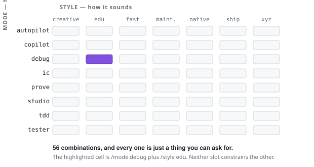</p>

Keeping them apart is what keeps the file count down. Nine modes and six styles cover fifty-four combinations, so a new way of talking costs one file rather than nine rewrites.

**The test for which one a new idea is:** does it have an order of operations? If it says do this, then that, and stop here, it is a mode. If it only changes the texture of what you were already doing, it is a style.

That test is why the diagrams below come in two shapes. Every mode is drawn as a pipeline, because it has one. Every style is drawn as a transformation of the same reply, because a style has no steps and drawing it as a flow would misrepresent what it is.

---

## How it actually holds

A `UserPromptSubmit` hook runs *before* Claude reads your message. It performs any switch you asked for, so the slot is already set by the time Claude sees anything, then injects the contract text into the prompt itself.

<p align="center">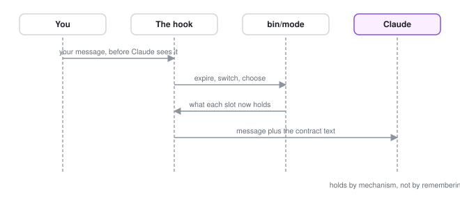</p>

What gets injected depends on whether this is the first prompt or a later one:

<p align="center">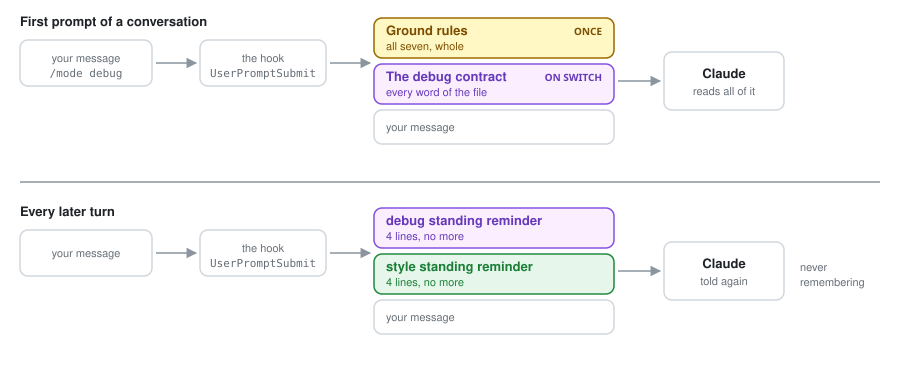</p>

So Claude is never remembering which mode it is in. **Every single turn, it gets told again.**

### The pipeline is told again too

Every mode declares its steps in front matter, `steps: read, fork?@question, ground, …`, and that pipeline is what the status line draws. It is also state. `mode mode step` answers where you stand, and the same answer is injected under the standing reminder on every turn:

```text
Pipeline, step 3 of 7: ground.
Done: read, fork. Next: shape.
Record with `mode mode done ground`, or say which step you are on.
```

A step advances two ways. The `@event` suffix names the moment that closes it, and most of those are observable, so a hook records them from the tool call itself: asking you a question, spawning an agent, writing an artifact, running a test, going red, committing. Nobody has to remember. Steps with no event are the thinking ones, and those are declared, which is what the injected line asks for. A diagram that stops moving is therefore either work that stalled or a step nobody recorded, and the line above tells you which.

That is why a standing reminder is capped at four lines. Two slots held at once give eight injected lines per turn, which is roughly the ceiling before a standing block reads as background noise and stops being seen. A contract body can run to any length, because it is read once. Only the block that repeats is rationed.

### A switch on its own never reaches Claude

Type `/mode debug` and nothing else, and the hook does the switch, prints the chips back to you, and ends the turn there. No request is made, so it costs nothing and answers in about a quarter of a second. A bare `/mode` or `/style` answers with that axis's contracts instead, the way `/model` lists models.

The moment your message carries anything beyond the switch, the turn runs normally. `/mode debug fix the parser` sets the slot and then goes to work, and so does a message with another plugin's command in it. The rule is simply whether a word is left over that only Claude can answer.

The contract is not spent on the turn that never ran. `/mode debug` on its own defers the whole contract to your next real message, which is the first turn that has any use for it.

The confirmation closes with "Set. The status line catches up when the conversation continues." That is not a caveat, it is the answer to the question you are about to ask. Claude Code redraws the status line off the model's reply, and a turn ending in the hook never writes one, so the chips printed back to you are the current ones and the line below follows on your next message.

---

## Ground rules, the third kind of file

Beside the two slots sits a set of files that are not switched at all. They live in `skills/mode/rules/`, layered under `~/.claude/mode/rules/`, and they are **always on**.

<p align="center">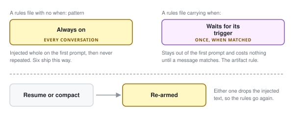</p>

Seven ship with the plugin:

| Rule | What it holds |
|---|---|
| `evidence` | Claims rest on something read this session; receipts over narration; honest confidence |
| `scope` | The diff stays inside the ask; fix causes, not symptoms; docs move with the code |
| `board` | Autonomous work runs on a visible task board, and a ticked box is a receipt |
| `collaboration` | Execute what is reversible, escalate what is genuinely yours, challenge by default |
| `prose` | Write the sentence you would say aloud; no em dashes; no symbols in prose |
| `deliverable` | Name what will land before producing it, then route it |
| `artifact` | Scoped: fires only when a page is on the way, carrying the theming and interactivity contract |

**Why this tier exists is economic.** A rule in a `CLAUDE.md` is paid for on every request of every session. A ground rule costs one injection per conversation.

A rules file needs only `name` and `summary` in its front matter. Drop a file with the same name into your own rules directory to replace a shipped one, or one with an empty body to silence it.

---

## The deliverable

What *lands* at the end varies independently of how the work ran, but it used to be welded into each mode: `debug` always ended in an explainer plus a merge request, `tester` always in a report. So there was no way to ask for one mode's rigour with a different ending.

The `deliverable` ground rule names the forms and routes each:

| Form | What it means | Where it goes |
|---|---|---|
| **chat** | The answer lives in the conversation, nothing is built | Stay inline; do not build a page nobody asked for |
| **artifact** | A page you open, keep and re-read | The `create-artifact` skill, always |
| **MR or PR** | A change plus the note a reviewer reads | Human prose, sectioned what and why, visuals where structure exists |
| **MVP** | The smallest slice that actually runs | Code, run once for real before it is called done |

Several at once is ordinary. The rule requires the form to be *stated* before it is produced, which is the actual fix: the wrong shape gets caught while it is still cheap.

---

## Starting and stopping without typing

Typing a name is not the only way in, and `off` is not the only way out.

<p align="center">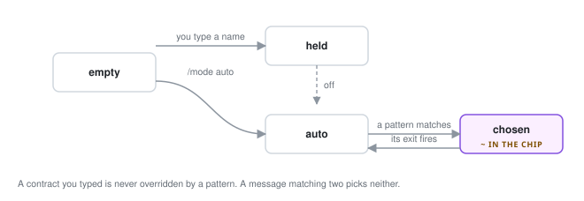</p>

| Key | Means |
|---|---|
| `enter-when` | Alternatives split on a vertical bar. One matching your message selects this contract, but **only while that slot is set to `auto`** |
| `enter-never: true` | Never chosen for you, must be typed. Only `autopilot` carries it |
| `exit-when: manual` | Only `/mode off` ends it |
| `exit-when: approved` | A yes was recorded with `/approve` under this contract |
| `exit-when: mr-opened` | A merge request exists for the branch it worked on |

Matching anchors at the **start** of a word and runs free at the end. So `fail` covers fails, failed, failing and failure, while `build the` never matches "rebuild the". That missing trailing boundary is deliberate, and it is why every alternative has to be verb-shaped: a bare `build` would fire on "the build fails on startup" and hand a broken pipeline to the mode that spawns a team.

---

## Pins, or the answer that is the same every time

A slot dies with the conversation, which is correct for a contract you set for one piece of work. It is wrong for the answer that never changes: this repo belongs to other people, so `native`; that one goes out to dependents, so `ship`. Retyping it every morning is exactly the memory problem the plugin exists to remove, moved up one level.

A **pin** is that answer written down once. It fills a slot at the start of every conversation held inside a directory, and nothing else.

```bash
mode style pin native          # here and everywhere below here
mode pins                      # what a fresh conversation would start in, and which file said so
```

Two layers answer, and which one you reach for is a question about who the answer is for.

| Layer | Written by | Reaches |
|---|---|---|
| **Personal** | `mode <axis> pin <name>`, stored in `~/.claude/mode/pins.tsv` | You, on this machine |
| **Shared** | a `.mode` file committed in the repo, two lines of `axis: name` | Everybody who clones it |

Lookup walks up from the working directory and takes the first answer it finds, so a package deep in a monorepo can pin something the repo root does not. In one directory the personal layer beats the shared one, because your machine outranks somebody else's default. `mode <axis> pin off` is a personal no that masks a shared file without editing the repo, and `--forget` removes it again.

**What keeps a pin from becoming an override** is three restraints, and each one exists because the alternative is worse:

- A slot you typed into is never adopted over. So is one you turned off, for the rest of that conversation. Without this, `/mode off` in a pinned directory would be undone by your next message.
- Adoption happens once per axis per conversation. Without this, every switch you made would be reverted on the next prompt.
- A name this machine has no contract for is skipped rather than held, and it does not take the rest of the file with it. So a repo pinning somebody else's private contract costs a stranger nothing.

The status line tells the three sources apart: `native` you typed, `~native` the chooser picked, `=native` the directory pinned.

---

## `/why`, the window into all of it

Every mechanism above is invisible by design. The contract is injected where you cannot read it, the gates only announce themselves by refusing something, and the chips have room for a name and nothing else. So there is one command that shows the whole state:

```text
/why
```

Like a switch, it is answered inside the hook and never reaches the model, so it costs nothing and returns immediately. It prints five things:

| Section | Answers |
|---|---|
| **Slots** | What each holds, and whether you typed it, the chooser picked it, or a directory pinned it |
| **Pipeline** | Which step the held mode is on, what is behind it and what is next |
| **Gates** | Every flag the mode declares, whether it is open right now, and what would open it |
| **Ground rules** | Which have been injected already, and which are still waiting on a trigger phrase |
| **The next prompt carries** | Whether your next message costs the whole contract or the four standing lines |

The Gates section is the one worth knowing about before you need it. A guard refusing an edit reads like the tool being broken until you have seen the line that says which gate it was and what opens it.

---

## The nine modes

Each one is a pipeline. A yellow box is a gate, meaning the work genuinely stops there. A dashed line is a loop back.

### `ic`

The default, and the one to hold when no specialist fits. One senior pair of hands runs the whole loop while you stay in the room, borrowing each specialist's discipline without the ceremony.

<p align="center">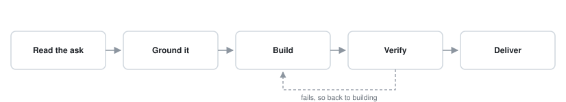</p>

### `copilot`

For work that splits into several independent domains. You refine it together, then a team builds it while you watch. This is the one mode with a real enforced gate.

<p align="center">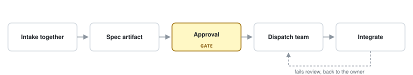</p>

### `swarm`

The same team, reached without a spec. Instead of agreeing a plan and dispatching against it, you keep a standing roster of owners, one per domain, and every ask is routed to whoever owns that domain. When nobody does, one is hired. The gate that replaces the approval is triage: an ask too unclear to route is refused rather than guessed at, since with no spec there is nothing to catch a wrong read before the work starts.

<p align="center">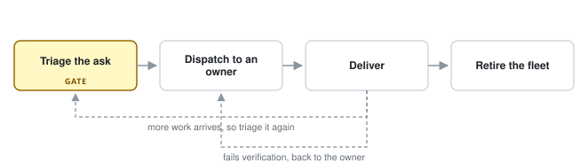</p>

### `autopilot`

You want a result and you are walking away. It is the same pipeline with the human gate removed, which is exactly why it can never be chosen for you and has to be typed.

<p align="center">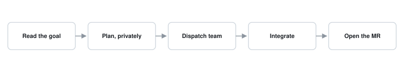</p>

### `debug`

Something is broken and nobody knows where. The gate is the important part: nothing moves forward on a bug that has not been seen failing.

<p align="center">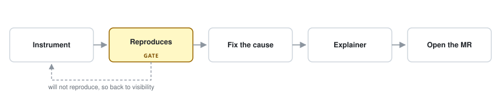</p>

### `tdd`

No implementation line exists before a test that failed for the right reason. Red means the assertion fired, not that the file failed to import.

<p align="center">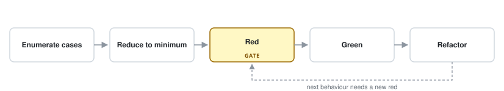</p>

### `goal`

For when "it works" is only half of done. A channel is anything that can disagree with you: a response body, a log line, an exit code. Reading the code is not one, and neither is your own opinion of your diff, which is why the audit goes to fresh eyes.

<p align="center">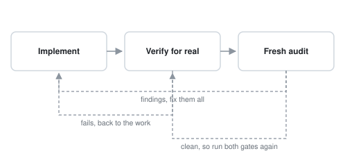</p>

### `tester`

A feature somebody else built needs sweeping. It ends in a verdict and fixes nothing, because a tester who fixes is reporting on their own work.

<p align="center">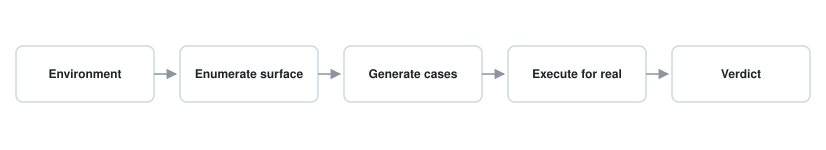</p>

### `studio`

Thinking something through, where the thinking itself is the deliverable. The only mode that is a cycle rather than a pipeline.

<p align="center">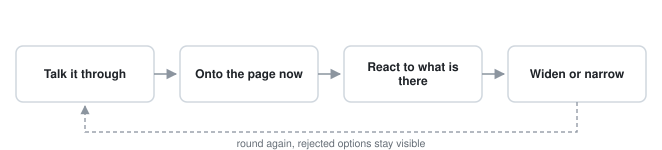</p>

---

## The six styles

A style has no steps, so each is drawn as what it does to the same reply: on the left what it would have been, on the right what it becomes.

### `edu`

You want to understand rather than be updated.

<p align="center">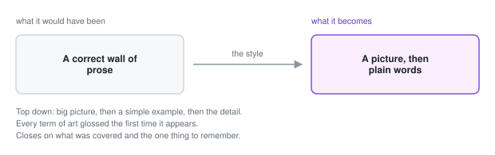</p>

### `fast`

You are in a hurry. Note the third line: fewer words never means less work.

<p align="center">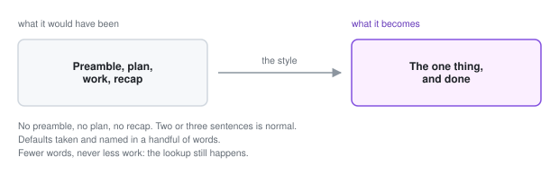</p>

### `ship`

It is going out and somebody else has to maintain it, so the change cannot travel alone.

<p align="center">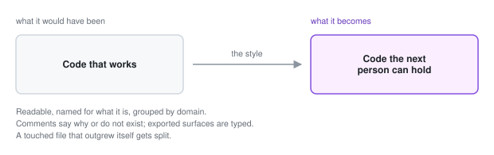</p>

### `native`

Somebody else's codebase, where your conventions are not welcome.

<p align="center"></p>

### `creative`

The safe first answer is not good enough. The last line is the boundary that keeps it usable.

<p align="center">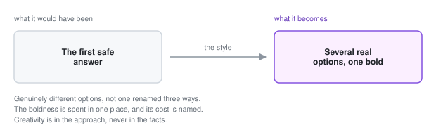</p>

### `xyz`

You write short and expect the rest inferred.

<p align="center">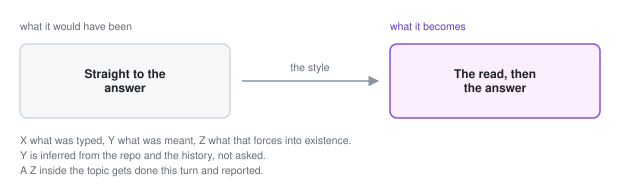</p>

---

## A worked example

Say you want a careful debugging session, explained as you go, because you are learning the codebase.

```text
/mode:debug /style:edu
```

Both land in one message. On that prompt Claude receives the ground rules whole, the entire `debug` contract, the entire `edu` contract, and your message. On every turn after, it receives only this:

```text
Active mode: debug
- Instrument before guessing. The first move is visibility, not a fix.
- Nothing is found until it reproduces on demand, by script or by your own hand.
- Correct fix by default; workaround only when it is burning, and say which.
- Branch, explain why in an artifact, open the MR on the yes, then leave.

Active style: edu
- The user asked to understand, so teach.
- Plain words, and a gloss on every term of art the first time it appears.
- Draw it. Anything with parts, flow or quantity gets a picture.
- Close on what was covered and the one thing worth remembering.
```

Eight lines. That is the whole ongoing cost, and it is why the cap matters.

When you eventually type `/approve <slug>` on the explainer, `debug` reaches its exit condition and clears itself. The `edu` style is untouched, because the axes never read each other.

---

## What is actually enforced

Worth being blunt, because a contract that asks politely and a gate that refuses are different things.

Two flags have a mechanism behind them, and any contract can declare either.

| Flag | What it refuses | What opens it |
|---|---|---|
| `no-dispatch-without-approval` | Spawning a teammate | A yes recorded with `/approve`, scoped to the mode that asked |
| `no-code-without-red` | Editing an implementation file | A suite the recorder watched exit non-zero, until a passing run closes the lap |

`copilot` carries the first, `tdd` the second. The second is narrow on purpose: it judges only files whose extension carries behaviour, outside a test directory, whose name is not test shaped. The test itself, prose, config and fixtures are never refused, because a rule that blocked those would block the only route to a red.

It also cannot tell a red from a broken test, since an import error exits non-zero too. It stops the failure that actually happens, which is skipping the test entirely.

Everything else rests on Claude being reminded every single turn, which is genuinely useful and is not a guarantee. The clearest remaining gap is `no-implement`: `copilot` declares it and no hook reads it, because no hook can tell a two-line seam between two finished domains from a domain somebody decided to build themselves.

Separately, **guards** ship in `hooks/guards/`, fencing the ground rules: the board fences, the prose fence, comment, null, red and shell-write guards. One switch disarms them all, `"guards": "off"` in `~/.claude/mode/config.json`, with absent meaning armed. The approval gate sits outside that switch, in `hooks/gate.py`, and `/why` says which of the two you are looking at.

---

## Writing your own contract

One markdown file in `~/.claude/mode/modes/` or `~/.claude/mode/styles/`, live as soon as you save it. The [README](README.md#writing-your-own) has the front matter table. Two things catch people out.

**A flag is on whenever the key is there and does not say no.** So `true`, `yes`, `1` and even a typo all count as on. It is off only when absent, empty, or one of `false`, `no`, `off`, `n`, `0`. That direction is deliberate: every flag is an opt-in restriction, nobody writes one meaning to leave it off, so a value that cannot be read lands with the restriction **on** rather than silently off.

**Write the standing block in the voice it is read in.** It gets injected into Claude's own prompt, so "the user speaks only to you, and no teammate writes to them" is a rule, while the same sentence turned around states the opposite one.

Then run `mode sync`, which rewrites the registries and writes the contract's palette entry so none of them drift from what is on disk.

The diagrams in this guide are generated by `scripts/draw-contracts.py`, so adding a contract means adding its entry there and re-running it.

---

## In short

- **Two slots**, one for how the work runs and one for how it sounds, independent in both directions.
- **A hook, not memory.** The contract is injected into every prompt: whole on the turn you switch, then four standing lines forever after.
- **A third tier**, ground rules, always on and injected once per conversation.
- **`auto`** lets contracts be chosen from what you write, with a tilde marking anything you did not type yourself.
- **A pin** is the answer that never changes, held by a directory rather than by a conversation, marked with an equals sign.
- **`/why`** shows the whole state at once, and costs nothing to ask.

If you remember one thing: **it holds by mechanism rather than by the model remembering it**, and that single property is what makes the contract still true on turn forty.

Next, the [README](README.md#the-modes) has the quick table of what each mode and style is for.
