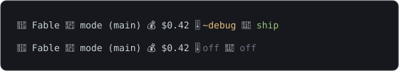
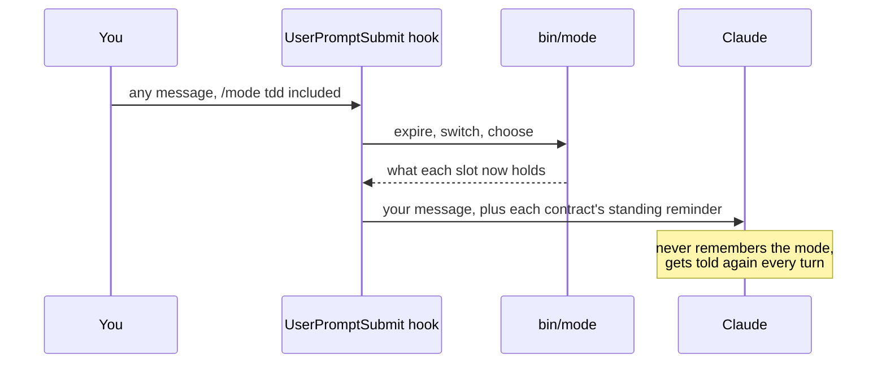
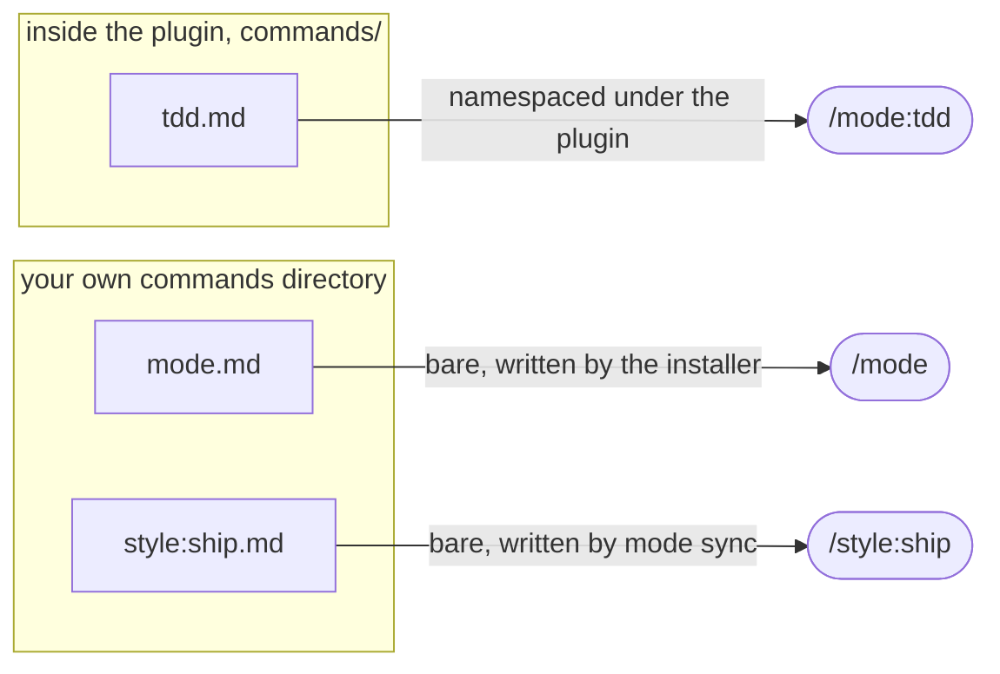
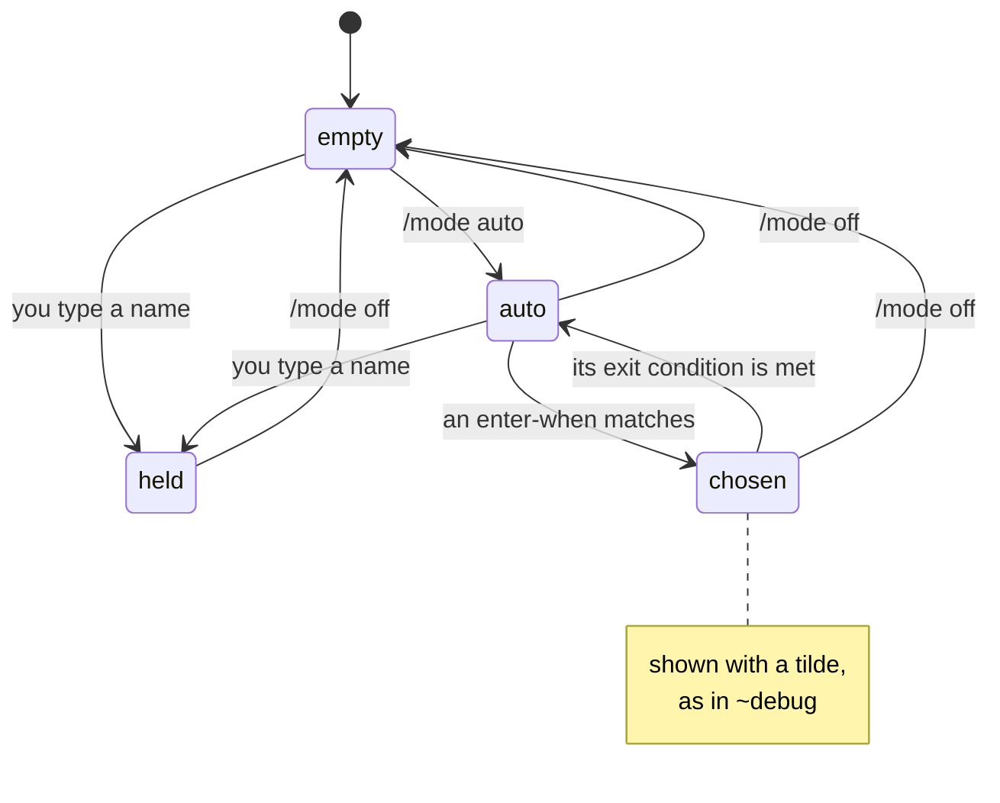

# mode

**Two slots for a Claude Code session. One holds a way of working, the other holds a way of talking.**

Claude Code sessions drift. You say "be brief" on Monday and by Thursday you are reading three
paragraphs again. You agree a careful procedure at the top of a conversation and forty turns later
nobody is following it. The usual fix is to repeat yourself, which works until you forget.

This plugin gives a session two slots that hold, and it holds them with a hook rather than with
Claude's goodwill.

<p align="center">
  
</p>

That is the whole surface: one chip per axis in your status line, `🎚` for the mode and `💬` for
the style, showing `off` when a slot is empty and a leading `~` when a contract was chosen for you
rather than typed.

## The two axes

A **mode** is a way of working. It is a procedure: steps, gates, and a point where you can say it
finished. A mode changes what Claude does next. `debug` is one, and it goes instrument, reproduce,
fix, explain, open the merge request, in that order, refusing to skip ahead to the fix.

A **style** is how Claude talks to you. It has no steps of its own. Instead it modulates every step
of whatever mode is running. `fast` is one, and it means do the single thing and say done.

They live on separate axes because one slot cannot say what people actually want:

```text
/mode tdd      # no implementation line before a test that fails for the right reason
/style fast    # and say almost nothing while doing it
```

Fold those two into a single setting and you are made to pick, so you lose whichever mattered less
that morning. Kept apart, they compose, and the forty-eight combinations are all just things you can
ask for.

Here is the question set that decides which axis something belongs on. It is worth reading before
you write a contract of your own, because most ideas sort themselves in about ten seconds.

| Ask | A mode answers | A style answers |
|---|---|---|
| Does it have steps and gates? | Yes. A procedure with a beginning and an end. | No. It has no steps of its own. |
| Does it enable something a prompt could not ask for? | Yes. A hook refuses something, or a chain of skills runs that otherwise would not. | No. It changes the register and what gets left behind. |
| Does it have a definition of done? | Yes. You can say when it finished. | No. It is held until you drop it. |
| What does it change? | What Claude does next. | How Claude talks to you. |

The second row does most of the sorting. "Write tests first" is an instruction you could type; `tdd`
earns a mode because it is a procedure with a gate in it. "Document as you go" changes what every
other procedure leaves behind, which is why it is the `maintainer` style rather than a `docs` mode.

## How it holds

Worth understanding before you install anything, because it explains the shape of everything else.

A `UserPromptSubmit` hook runs before Claude reads your message. It does two jobs in that moment.
First it performs the switch, so by the time Claude sees anything the slot is already set. Then it
injects a short standing reminder from each held contract into the prompt itself.



So Claude is never remembering which mode it is in. Every single turn, it gets told again.

That is also why a standing reminder is capped at four lines. Two slots can be held at once, giving
eight lines injected per turn, and that is roughly the ceiling before a standing block reads as
background noise and stops being seen at all. A contract can run to any length in its body. Only the
block that repeats is rationed.

## Install

You need `python3` and `jq` on your path. The installer checks for both and tells you which is
missing rather than failing somewhere in the middle.

There are two ways in, and the one you pick decides how you update later, so it is worth thirty
seconds of thought rather than copying the first block you see.

### Route one: as a marketplace plugin

This is the normal route, and the one to take if you just want the thing installed.

```bash
git clone <this-repo> ~/src/mode
cd ~/src/mode
./install.sh
```

Then register it with Claude Code, using that same clone as the marketplace source so there is only
ever one copy on disk:

```text
/plugin marketplace add ~/src/mode
/plugin install mode@mode
```

Restart Claude Code, or open a new conversation, and the status line picks it up.

Claude Code copies the plugin into its own cache when you install it, into a directory named after
the version. So the clone you made is the marketplace source, and the copy that actually runs lives
somewhere else. That distinction is invisible until you try to update, which is why the next
section exists.

### Route two: as a skills directory

Claude Code loads any directory under `~/.claude/skills/` as a plugin in its own right, hooks and
commands included. Point that name at your clone and there is no cache copy at all:

```bash
git clone <this-repo> ~/src/mode
ln -s ~/src/mode ~/.claude/skills/mode
cd ~/src/mode
./install.sh
```

It shows up as `mode@skills-dir`, and Claude Code reads your working tree directly. Take this route
if you plan to write contracts of your own, or change the plugin itself, because an edit is live in
the next session with nothing to reinstall. The cost is that you are now responsible for keeping
the clone current, since nothing will offer to update it for you.

Either way, `claude plugin list` tells you which one you ended up with.

### What the installer does, and why it is a separate step

Four things, and not one of them is something a plugin can do for itself.

**It asks your name.** The contracts refer to you through a `{{USER}}` placeholder, substituted at
injection time. This matters more than it looks. A line like "the user speaks only to you, and no
teammate writes to them" is load-bearing about which direction the rule runs, and the standing block
is read by the model rather than by you. Get the voice wrong and the sentence states the opposite
rule.

**It creates `~/.claude/mode/modes/` and `~/.claude/mode/styles/`** for contracts you write
yourself. More on those below.

**It wires the status line.** This is the awkward one. A status line is a single setting, so a
plugin that installed its own would silently wipe whatever you already had. So this plugin emits and
does not own. `bin/mode chips` prints one entry per axis, `🎚` for the mode and `💬` for the style,
each showing its contract's name in the contract's colour or `off` when the slot is empty, and your
existing line embeds that output as it is.

| What you have | What the installer does |
|---|---|
| No status line at all | Writes a small one whose only job is to print the chips. |
| A status line already | Never overwrites it. Shows you the block to add, offers to append it, and shows the diff before writing. |
| A settings file that is a symlink | Resolves it and writes through it, so the link stays a link. |

> [!WARNING]
> That last row is not hypothetical. Claude Code replaces `settings.json` with a regular file
> whenever it writes a setting, and if yours is a symlink into a dotfiles repo, the repo copy
> quietly stops being the live one with nothing to tell you. The installer takes a timestamped
> backup first and prints every path it touched.

**It writes the bare command names**: `/mode`, `/style` and `/approve` are three small files in
your own commands directory, because a plugin cannot register an un-namespaced command. It then
runs `mode sync`, which adds one palette shortcut per contract: `/mode:<name>` for each mode inside
the plugin, `/style:<name>` for each style beside the bare files. Skip them with `--no-aliases` and
those names simply do not resolve.

Run it twice and the second run reports what is already in place and changes nothing. `./install.sh
--help` lists the flags, including `--no-status-line` and `--no-aliases` if you would rather wire
either yourself.

If you would rather be walked through it, ask Claude to read `skills/init/INIT.md` in the plugin
and follow it. That walkthrough asks the same questions in conversation and then calls the same
script. It is deliberately not a registered skill, so it takes no palette entry and no tokens; it
never edits `settings.json` itself, for the symlink reason above.

## Updating

Start by finding out where you are. These two answer different questions and it is worth running
both:

```bash
claude plugin list          # the version Claude Code is loading, and from which route
./bin/mode version          # the version of the clone you are standing in
```

Nothing puts `mode` on your path, so that second one is always a path to the script. From outside
the clone it is `~/src/mode/bin/mode version`.

> [!TIP]
> When those two disagree, the update has not landed yet. That is the single most useful check on
> this page, because every failure mode below shows up as exactly that disagreement.

### If you installed as a marketplace plugin

Two steps, because the marketplace and the plugin are separate things. The first re-reads the
source to find out what is on offer, and the second installs it:

```bash
claude plugin marketplace update mode
claude plugin update mode@mode
```

If your marketplace source is a local clone, `git pull` in that clone first, otherwise the
marketplace update re-reads the same commit it read last time and reports that nothing changed.

> [!IMPORTANT]
> Then restart Claude Code. The command says so itself and it is not a formality: hooks and
> commands are read once when a session starts, so a running session keeps the old copy until it
> ends.

### If you installed as a skills directory

Pull, and restart:

```bash
cd ~/src/mode && git pull
```

There is no install step and no `claude plugin update` to run, because there is no second copy to
bring into line. This route is not listed in `installed_plugins.json` at all, so anything that
works off that file has nothing to say about it.

### Why the version number matters more than it looks

A marketplace install unpacks into `~/.claude/plugins/cache/<marketplace>/<plugin>/<version>`. The
version is part of the path, so a bumped number means a new directory and the old one stays where
it is until you clean it up. A plugin whose `plugin.json` carries no version at all installs into a
directory called `unknown` and every future update overwrites it in place, which is a good way to
end up with two versions blended together. This plugin carries a real version, and `bin/mode
version` prints it.

That same fact is why the status line keeps working across an update. The chips are printed by a
small script the installer puts in your own config directory, and it re-resolves where the plugin
lives on every render rather than baking in today's path. Bake the path in and the chips go quiet
after the first update, with no error anywhere to explain it.

### What an update will not touch

Contracts you wrote yourself, in `~/.claude/mode/modes/` and `~/.claude/mode/styles/`. They sit
outside the plugin directory on purpose. Your identity config stays too, so nothing asks your name
a second time. Anything you edited **inside** the plugin directory is a different story: on the
marketplace route it is in a cache directory that the next version simply stops using, and on the
skills-dir route `git pull` will conflict with it. Keep your own work in the user contracts
directory and neither happens.

### Reading what changed

`CHANGELOG.md` carries it, newest first. Versions are the number in `plugin.json`, this project is
pre-1.0, and a minor bump means new contracts or changed behaviour rather than a stable promise.

### Cutting a release, if you are the one publishing

```bash
claude plugin tag --dry-run     # check plugin.json and the marketplace entry agree
claude plugin tag --push        # create mode--v<version> and push it
```

It refuses on a dirty working tree, and it refuses if the two manifests disagree about the version,
which is the mistake worth being stopped for.

## Using it

```text
/mode              # list what is available, and say what is held
/mode debug        # hold debug
/mode off          # empty the mode slot

/style             # the same three, for the style slot
/style fast
/style off
```

**A bare name goes to whichever axis owns it, so you do not have to remember which is which.**
`/mode maintainer` fills the style slot, because `maintainer` is a style and there is no mode by
that name. Typing it on the wrong command used to fail quietly, which looked like it had worked.

You can also set both at once, in either order:

```text
/mode tdd maintainer     # a mode and a style in one go
/mode maintainer tdd     # the same thing
```

Only `auto` and `off` stay tied to the command you typed them on, since neither one names a
contract. `/mode off` empties the mode slot and leaves the style alone, which is what you want.

### Every contract has its own shortcut

Typing `/mode ` and remembering what exists is the slow path, so each contract is also a command in
its own right, and the palette holds exactly three shapes:

```text
/mode                  # the bare command, plus /style and /approve beside it
/mode:tdd              # one entry per mode, namespaced under the plugin
/mode:tester
/style:ship            # one entry per style, arriving bare
/style:edu
```

The two shapes exist for a reason worth knowing before you write a contract of your own. Claude
Code namespaces a plugin's commands under the plugin, so a mode ships inside the plugin and arrives
as `/mode:tdd`, with the axis already in the name. A style shipped the same way would arrive as
`/mode:style:ship`, which buries every entry under the same prefix, so `mode sync` writes the style
shortcuts into your own commands directory instead, where nothing prefixes them and they arrive as
`/style:ship`.

The bare `/mode`, `/style` and `/approve` live in that same directory, written by the installer,
because a plugin cannot register an un-namespaced command at all. Skip them and those three names
do not resolve.



All of it is generated: `mode sync` rewrites the shortcuts from the contract folders, so writing a
new contract gives it a palette entry with no second step, and deleting one takes its entry away.
The shortcuts do exactly what the longer spelling does, and the hook treats them as one code path.

> [!WARNING]
> On Windows a style's shortcut cannot exist: the colon in its filename is legal on macOS and
> Linux and illegal there. The spaced spellings `/style ship` and `/mode tdd` do the identical
> thing.

The two slots are independent. Setting one never touches the other, and `off` on one leaves the
other exactly as it was.

Both slots also accept `auto`, which lets a contract be picked from what you write. Each file
declares an `enter-when` pattern, and with the slot on `auto` a matching message selects that
contract. Three restraints keep this from being annoying. A contract you set by hand is never
overridden by a pattern. A message matching two patterns picks neither and leaves the slot alone.
And a contract picked for you is marked as such in the status line with a leading tilde, so `~debug`
tells you the chooser filled the slot while plain `debug` means you typed it.

One slot's whole life, and the tilde is the difference between the two held states:



## The contracts

Eight modes:

| Mode | What it is |
|---|---|
| `copilot` | You refine the work together, then a team of agents builds it while you watch. |
| `ic` | Copilot without the spec. You refine the work together, then Claude builds it himself: no team, no approval gate, forks asked as they appear. |
| `autopilot` | You want a result and you are away. Every decision is Claude's, and one report waits for you. |
| `debug` | Find it, prove it reproduces, fix it, and draw why it happened. |
| `prove` | Nothing is claimed working until a channel that can disagree with you says so. |
| `studio` | Think something through together on one artifact, and it grows while you talk. |
| `tdd` | No implementation line exists before a test that fails for the right reason. |
| `tester` | Work out what to test and how to reach it, run it for real, report a verdict, fix nothing. |

Three of those are about correctness and they are genuinely different jobs, which is worth a line
because the names blur together. `tdd` writes the test before the code exists. `prove` takes one
change you just made and refuses to call it working until something outside your own head agrees.
`tester` takes a feature somebody else built and sweeps it, then hands you a verdict without
touching the code.

Six styles:

| Style | What it is |
|---|---|
| `edu` | Teaching. Overview first, then a simple example, carried by visuals rather than walls of prose. |
| `xyz` | Every reply opens with the read: X what you typed, Y what you meant, Z the adjacent work that forces. Inferred from the repo, not asked. |
| `fast` | You are in a hurry. It gets made to work and nothing gets polished: no tests, no naming care, no abstraction, and the answer is short. |
| `maintainer` | Other people depend on this. Tests, README, API docs and changelog move with the code. |
| `ship` | It is going out, so it has to be maintainable: readable, well named, grouped by domain, with our own standard applied where the repo has none. |
| `native` | Somebody else's codebase. Match the local idiom exactly and contribute none of your own. |

One mode brings a third command with it. `copilot` will not spawn a team of agents until you have
approved the spec it wrote, and `/approve <slug>` is how you say yes:

```text
/approve payments-refactor
```

That one is deliberately yours alone. It carries `disable-model-invocation: true`, so Claude cannot
run it on your behalf, which is the point of having a gate at all.

Forty-eight pairs are possible and most of them compose without comment. A few are worth knowing
about. Holding `tdd` and `fast` together asks for a failing test before every line and also for
tests to be skipped, so there is no order of operations that satisfies both. Holding `studio` with
`ship` fights itself too, since studio deliberately ships nothing. On the productive side, `debug`
with `fast` picks the workaround over the durable fix, which is what you want while production is
burning, and `debug` with `ship` or `maintainer` picks the other half of that same fork.

## Writing your own

One markdown file, dropped in `~/.claude/mode/modes/` or `~/.claude/mode/styles/`. It is live as
soon as you save it, because the tool reads the folder rather than a registry you have to keep in
step.

```markdown
---
name: recon
summary: A codebase you have not seen. Build the map before touching anything.
color: cyan
enter-when: new repo|unfamiliar|where do I start
exit-when: manual
---

# Recon mode

The full contract, at whatever length it needs. This is read once, at the moment of
the switch, so there is room here to be properly explicit.

## Standing reminder

- Read before writing. Entry points, data flow, conventions, the test command.
- Report the map, then propose.
- No edits in the first pass.
```

The keys:

| Key | Meaning |
|---|---|
| `name` | Must equal the filename without its extension. |
| `summary` | One line, and keep it under 80 characters. It is what the listing prints and what the status line chip shows, so a long one wraps the line. |
| `color` | One of red, green, yellow, blue, magenta, cyan, grey, pink. |
| `enter-when` | Alternatives split on a vertical bar, matched at a word boundary. Only consulted while the slot holds `auto`. |
| `enter-never` | Present, and not explicitly switched off, makes a contract typed-only and never picked for you. |
| `exit-when` | `manual`, `approved`, or `mr-opened`. Leave it out and the contract behaves as `manual`. |

Two details save you a debugging session.

**A flag is on whenever the key is there and does not say no.** So `true`, `yes`, `1` and even a
typo all count as on. It is off only when the key is absent, empty, or set to one of `false`, `no`,
`off`, `n` or `0`, in any case and with quotes stripped. That direction is deliberate. Every flag
here is an opt-in restriction, nobody writes one meaning to leave it off, so a value that cannot be
read lands with the restriction **on** rather than silently off. Setting `enter-never: false` is
the way to turn it off, and deleting the line does the same.

And an unknown key is ignored rather than being an error, which is what lets a file written for a
later version still load here.

**The four-line cap on `## Standing reminder` is real.** It is the only part of your file that
repeats, and it repeats on every prompt for as long as the slot is held. Write each line as a rule
that binds in the moment, and write it in the voice the model reads it in rather than the voice you
would say it in. Prose about your philosophy belongs in the body, where it is read once and costs
nothing thereafter.

### Where your own contracts live

In `~/.claude/mode/modes/` and `~/.claude/mode/styles/`, both created for you by the installer. If
you set `CLAUDE_CONFIG_DIR`, they follow it. That directory layers over the contracts the plugin
ships, so your files survive an update, and one of yours named the same as a shipped contract wins.
Anything you write inside the plugin directory itself is lost the next time you update.

## Limitations

Read this part. Every item here is a real thing the release does not do.

**Nothing persists across conversations.** Both slots are keyed to the conversation and both die
with it. Start a new session and you start with empty slots. There is no project default, no global
default, and no way to say "always use `maintainer` in this repo". This is the limitation people
notice first, and it is a design choice for the first release rather than an oversight, because a
contract that outlives the work it was set for is worse than no contract.

**Only one mode enforces anything.** `copilot` has a real gate: a `PreToolUse` hook refuses to spawn
a teammate until you have approved a spec. That is the entirety of the enforcement in this release.
`tdd` is the clearest gap, since the rule it wants would refuse an edit to an implementation file
while no failing test is on record, and that hook is designed but not built. So `tdd` here is a
discipline and not a fence. `tester` wants the mirror image of that rule, refusing an edit to the
code under test while a sweep is running, and it does not have it either. Two contracts also carry
a `no-implement` flag that no shipped hook reads. Take every mode except `copilot` as a written
agreement that Claude is reminded of on every turn, which is genuinely useful and is not the same
thing as a guarantee.

**The one gate that exists checks that you approved, not that there was anything to approve.**
`copilot` refuses to spawn a team until an approval is on record, and that part works. What it never
checks is whether the slug you approved names a spec that was actually written. Typing `/approve`
followed by any word at all opens it. The stronger version would confirm the artifact exists and was
put in front of you, and it leaned on a personal tool that does not ship here. So read this gate as
"a person deliberately typed a yes", which is a genuine speed bump in front of a model dispatching
on its own initiative. Do not read it as "the spec was written and reviewed".

**The rule library is designed and not built.** The idea is that each enforcement is a named rule
with a hook behind it, and a contract declares the ones it needs with a `requires:` line. That would
let a contract you write turn on real enforcement rather than only asking politely. What exists
today is one hardcoded flag read by one hook, so the rule has no name and there is no way to ask for
it from a file of your own. This is the largest gap between what the system is and what it should
be.

**Only some pairs have been reasoned about.** Forty-eight combinations exist and the contradictory
ones are documented above rather than refused. Nothing stops you holding `tdd` and `ship` together.
You will get incoherent behaviour and no warning.

**The `auto` slot matches on plain substrings at a word boundary.** It is deliberately simple and it
will sometimes pick wrong. If that bothers you, leave the slots on manual and type the name.

There is one miss worth naming, because it is the most obvious phrase in the whole catalogue.
Typing "write a failing test" with the mode slot on `auto` selects nothing at all. `tdd` matches
the phrase and `debug` matches `fail` inside "failing", and a message that matches two contracts
deliberately chooses neither. The rule doing that is the right rule, and the collision is real, so
the fix is either a narrower stem for `debug`, which would lose "failed" and "failure", or a
tie-break on specificity. Until one of those lands, type `/mode tdd`.

## Licence

MIT, in `LICENSE`. This is a small tool made of markdown contracts and one script, and the point is
that people copy it, cut it down, and paste their own contracts into it. MIT puts nothing in the way
of that beyond keeping the notice.
