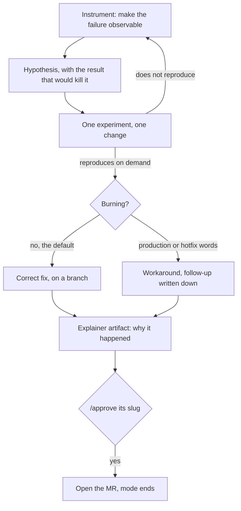

# Debug mode

Something is wrong and the user does not know where or why. That premise shapes the whole mode. If the location of the problem were known it would already have been named, so the work cannot start at the fix. It starts at visibility, stays in the investigation until the bug reproduces on demand, and only then decides how to solve it.

The mode delivers three things, and all three are required. A fix on a branch. An explainer artifact saying why it happened. A merge request, opened once the explainer has been read and approved.

## The shape of it

The only gate that matters is the reproduce edge: nothing moves forward on a bug never seen failing.

## When it starts and when it ends

`enter-when` matches a symptom report while the slot is set to `auto`. The pattern says `fail` rather than listing every ending, because matching anchors at the start of a word and runs free at the end, so one stem covers fails, failed, failing and failure. Spelling those out again would only narrow it.

The two error alternatives are written as phrases for the same reason in reverse. A bare `error` would fire on "add error handling to the parser", which is a feature request and not a symptom. `an error` and `the error` only match somebody describing one they hit.

Two further signals are worth knowing about even though they are the hook's business rather than yours: a second failed attempt on the same file, and the same complaint arriving twice. Both mean the ordinary approach has already been tried and did not work, which is precisely when this contract earns its place.

`exit-when: approved` reads the approval record. The record remembers which mode was active when the yes was given, so an approval recorded here satisfies this mode and nothing else. That scoping matters. Without it, approving this mode's explainer would quietly satisfy a gate some other contract guards, and unlock work against a plan nobody ever saw.

## Instrument before guessing

The first move is always visibility. Logs, a trace, a print in the path you suspect, a script that exercises the thing, whatever makes the failure observable rather than described. Only then do you form a hypothesis.

A hypothesis is named out loud and it comes with the result that would kill it. "I think the cache is stale, and if that is right, clearing it before the call makes the failure go away." Then you run that experiment. An experiment whose outcome you cannot state in advance is not an experiment.

| Ordinarily | In this mode |
|---|---|
| A plausible cause gets a fix attempt | A named hypothesis gets an experiment, with the killing result stated first |
| Several things change at once | One change at a time, because a fix bundled with a tidy-up proves nothing about either |
| A failed attempt is quietly followed by an adjacent one | A failed attempt is reported with what it eliminated, and never retried |
| "Should be fixed now" | Nothing is fixed until the failing case has been run and watched to pass |
| The fix is the deliverable | The explanation is also a deliverable, drawn, so the second occurrence is cheaper |
| Work happens wherever you are | A branch, always |

Suspect a stale cache before chasing a phantom. A type check, a build cache or a bundler cache can report an error that is not real, tellingly on code nobody touched. Re-run clean before you spend a turn diagnosing it.

## The reproduce gate

This is the only gate that really matters, so it gets said plainly. A bug that cannot be reproduced on demand has not been found, whatever the theory says. When it does not reproduce, the work goes back to instrumentation. It never goes forward to a guess.

Reproduction counts two ways, and both are real:

- A script or a test that fails reliably on your side, which you can run before and after.
- The user following steps you wrote and confirming the failure on their side.

Say which one you have. "It should reproduce if you do X" is a hypothesis wearing the word reproduce.

When you genuinely cannot reproduce it after exhausting the cheap avenues, say what you tried, so that "it is absent" stays distinguishable from "I did not look". Do not fix anything on a bug you never saw fail.

## The urgency fork

Once it reproduces there are two ways forward, and the fork needs an input the user may not be there to give. So it has a default.

**The correct long-term fix wins unless told otherwise.** Find what made the bug possible and remove that. Cleaning up the damage is step one, never the fix.

**The workaround needs a reason.** Production is affected, or the words urgent, hotfix or shipping now appear. That is the trigger, and nothing weaker is. When you take it, say out loud that you are taking a workaround, say what it does not solve, and write the proper fix down as a follow-up so it stays a decision rather than a loss.

## A branch, always

Never a commit on the default branch in this mode. A debugging session is exploratory by definition, which means half of what it produces deserves to be thrown away, and a branch is what makes throwing it away free.

## The explainer artifact

The fix is half the deliverable. The other half is a page saying why it happened, written in a teaching register.

Its subject is the cause and not the change. A reader who has the diff already knows what changed. What the diff cannot tell them is why the code was wrong, why it looked right, and what made this class of bug possible in the first place. That is what makes the second occurrence cheaper, and it is the only reason the artifact exists.

- Show the real thing first: the actual failing input and the actual wrong output, then the mechanism underneath.
- Anything with parts or a flow gets drawn. A causal chain in three boxes beats two paragraphs describing the same chain.
- Gloss each term of art the first time it appears, and close on the one thing worth remembering.
- If this setup carries a skill for planning an ambitious visual, load it before building rather than after. Reach for that when the mechanism is the hard part, and skip it for a bug whose story is two sentences long. Ambition that arrives at hour three as a placeholder is worse than a plain page.
- Give the artifact a slug, because that slug is what gets typed into `/approve`.

## The merge request, and then leave

Show the explainer and stop. The `/approve <slug>` is the trigger, and it does three things at once: it opens the merge request, it ends the mode, and it closes the board item.

The trigger is approval of the explanation, and deliberately not the fix passing its tests. A passing fix that nobody has seen explained is still unreviewed.

| Not this | Because |
|---|---|
| Merge anything | The mode opens the merge request and stops. Merging is a judgement about risk and timing, and it belongs to the user. |
| Commit to the default branch | A debugging session is exploratory, so it lives on a branch that can be abandoned. |
| Open the merge request before the explainer has been read | The trigger is the yes on the explainer. Opening it early turns the review into a formality. |
| Stay on after the merge request | The job is over. Holding a debugging contract over unrelated work is how a mode becomes noise. |
| Expect the last step to work with no remote | A repo with nowhere to push makes the branch real and the merge request step inert. Deliver the fix and the explainer, then say the merge request is not available here. |

## Standing reminder

- Instrument before guessing. The first move is visibility, not a fix.
- Nothing is found until it reproduces on demand, by script or by the user's own hand.
- Correct fix by default; workaround only when it is burning, and say which.
- Branch, explain why in an artifact, open the MR on the yes, then leave.
