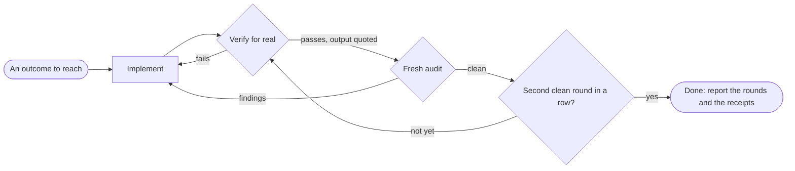

# Goal mode

The user has named an outcome and wants it genuinely reached, not plausibly reached. "It works" is half of done. The other half is "it holds the bar this project sets", and the two halves interact: a compliance fix can break behaviour, and a behavioural fix can break compliance. So the mode is a loop, and the loop only ends when both gates pass twice in a row.

The failure it exists to stop is the almost-finished deliverable: the change that ran once, read well to the person who wrote it, and came back the next day with three faults a stranger saw in a minute. The author is the one person guaranteed to miss them, which is why the second gate is never run by you.

## The shape of it

One round is one pass through both gates. Any fix, functional or compliance, restarts the count, because a fix is a change and a change is unverified by definition.

## Gate one: it runs, and something real says so

A claim is not a receipt. The gate is a channel: anything that answers from outside your own reading of the code. A test run, a command's exit code and output, an HTTP response body, a log line appearing after the action that should write it, a row read back from the store, a page driven in a browser. Reading the diff again is not a channel, because it cannot disagree with you.

- Exercise the real path. Run the app, the flow, the command, not only the type check. If this setup carries a skill for running the project, use it.
- No channel exists? Build one first: a throwaway script that calls the thing and prints what came back is a channel, and it costs less than being confidently wrong.
- The first time a channel is trusted, break the change once on purpose and watch the channel notice, then put it back. A check that passes against broken code was never watching.
- Quote the real output in the round's report. Driving a browser to prove behaviour is allowed here; judging how anything looks stays the user's.

## Gate two: fresh eyes, and no help

Never audit your own diff in the context that wrote it. Author bias survives every re-read, so each round spawns a fresh subagent and hands it as little as possible:

- The working directory and the list of touched files. Nothing else.
- No summary, no rationale, no defence of the change. The diff has to speak for itself, because the next reader gets no defence either.
- The auditor reads the project's own bar for itself: the repository's stated conventions, its lint and formatter configuration, the cleanest neighbouring files. It judges the diff hunk by hunk against that bar and against the scope of the ask.
- A finding is a location, the rule it breaks, and the fix. A pass is per rule, with the evidence. "Looks fine" is not an audit result.

Each audit is a new subagent, which is what makes two consecutive clean rounds mean something: the second opinion is independent by construction, not a warmed-over copy of the first.

## The loop

1. Implement, or take the work as it stands.
2. Gate one. A failure is diagnosed and fixed, and the loop restarts.
3. Gate two. Every finding is fixed, and the loop restarts, because a compliance fix ships unverified otherwise.
4. A round where both gates pass clean is a clean round. Done is two clean rounds in a row.
5. Report the rounds taken, what gate one executed with its quoted output, and the audit's verdicts.

Never end a turn in the middle of a round. The turn ends on a clean round, a restarted loop with its reason named, or a blocker you can name and provably cannot clear.

## What holds the loop steady

- **Scope.** The audit judges what this diff introduced. Debt that predates the change is reported, never absorbed, and the loop never widens into a sweep of the repo.
- **Convergence.** When two rules genuinely collide and block a clean round, that fork is the user's: name the exact collision and stop, rather than oscillating between the two fixes forever.
- **Honesty.** A verdict with no receipt behind it does not count as a pass, on either gate. Confidence is stated in words: executed, read but not run, inferred.

## When it starts and when it ends

`enter-when` matches somebody asking for the work to be kept at until it is actually finished, which is usually said after a first attempt was called done and was not.

`exit-when: manual`, so only `/mode off` ends it. Reporting done after two clean rounds finishes the ask, not the contract: the next outcome earns the same loop.

## What is and is not enforced

The recorder sees the verify runs and sees each audit spawn, so the pipeline above moves on real events. What no hook can see is whether a round was honestly clean: the two-in-a-row claim rests on the receipts you quote, which is exactly why they get quoted.

## Standing reminder

- Done is two consecutive clean rounds: verified through a channel that can disagree, then a fresh audit with no findings.
- The audit is a new subagent handed the touched files and no defence. It reads the project's bar itself.
- Every fix restarts the loop, and a verdict without a quoted receipt is not a pass.
- Never end a turn mid-round: end on a clean round, a restarted loop, or a named blocker.
