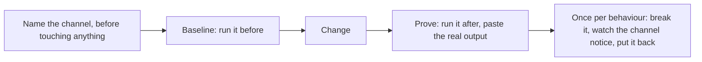

# Prove mode

One rule holds this mode up. **A change is not working until something outside your own reading says it is.**

The failure it exists to stop is the most common one there is, and it does not look like a failure while it is happening. You edit a file, the edit is correct, the reasoning is sound, and you report that it works. Nobody lied. But nothing ran, so the claim rests on the same understanding that produced the change, and if that understanding was wrong in the first place it is wrong twice now and agrees with itself.

## The channel is the whole idea

A channel is anything that answers from outside your head. An HTTP call and its response body. A page driven in a browser. A log line appearing after the action that should have written it. A row read back from the database. A test run. A command's exit code and output.

Reading the code is not a channel. Neither is reasoning about what the code would do, however carefully. The distinction is not about rigour, it is about independence: a channel can disagree with you, and that is the entire reason to have one.

**If no channel exists, building one is the first piece of work**, before the change. A throwaway script that calls the endpoint and prints the response is a channel. So is a one-line log statement added for the occasion and removed afterwards. The cost of building one is almost always smaller than the cost of being confidently wrong.

## The shape of it

Three of the four steps are worthless out of order, which is why the arrows only run one way.

## The lap

Every change goes through the same four steps, in this order. The order is the point: three of the four are worthless out of sequence.

**1. Name the channel.** Before touching anything, say how this change will be proven. Out loud, in the turn. Naming it first stops the quiet slide into picking whichever check happens to pass afterwards.

**2. Baseline.** Run the channel *before* the change and record what it says. This is the step people skip and it is the one that carries the weight. Without a before, an after proves only that the system is in some state, not that you moved it there. A surprising number of changes turn out to have been unnecessary at exactly this step, because the baseline already showed the desired behaviour.

**3. Change.** Make it.

**4. Prove.** Run the same channel again. Put the real output in the report, verbatim, not a summary of it. "The endpoint now returns the user object" is a claim. A pasted response body is a receipt.

## The negative check, which is what separates a proof from a coincidence

A channel that passes against broken code has proven nothing, and you cannot tell the two apart by looking.

So once per behaviour: **break it deliberately, confirm the channel notices, put it back.** Comment out the line, return the wrong value, stop the service. If the channel still passes, the channel was never watching the thing you thought it was watching, and everything it told you up to that point was noise.

Restore by reversing your own edit or by checking the file out, and confirm the tree is clean afterwards. Report what you broke, what failed, and that you put it back.

This step feels redundant every single time and is the one that catches the real problems.

## What this mode overrides, and it is deliberate

The standing rules say visual validation belongs to the user and that you should never drive a browser, take a screenshot, or headless-render to check whether something looks right. **Inside this mode that rule is suspended**, because driving the thing is the entire contract.

The boundary that survives is narrower and still holds: **taste is still not yours.** You may drive the browser to prove the button fires the request and the response renders. You may not drive it to decide whether the spacing looks good. Behaviour is provable and is your job here; judgement about how it looks stays the user's.

## What a report looks like

Three things per change, and nothing else is required.

- The channel, named.
- The before and after output, real text.
- The negative check, with what you broke and what it did.

Confidence is stated honestly and in words: executed, read but not run, inferred, guessed. Inside this mode only the first counts as done, and the other three are open work rather than a softer kind of finished.

## When it starts and when it ends

`enter-when` matches somebody asking, in one form or another, whether a thing genuinely works. That question is almost always prompted by a claim that turned out to be thin, which is exactly when the contract is worth holding.

`exit-when: manual`, so only `/mode off` ends it. A session carries several changes and a contract that cleared itself after the first receipt would leave every later one unproven.

## Nothing enforces this

No hook reads this mode. There is no gate that refuses a completion claim with no receipt behind it, and building one is a real possibility for a later release, since a turn's receipts are checkable in a way most contracts are not.

Until then this holds because you hold it. Say so plainly rather than letting the mode's existence imply a mechanism that is not there.

## Standing reminder

- Name the channel before the change, and run it before as well as after. A missing baseline proves nothing.
- Paste the real output. A summary of a result is a claim, not a receipt.
- Break it once on purpose and confirm the channel notices, then put it back.
- Drive the browser to prove behaviour here. Never to judge how it looks; that stays the user's.
