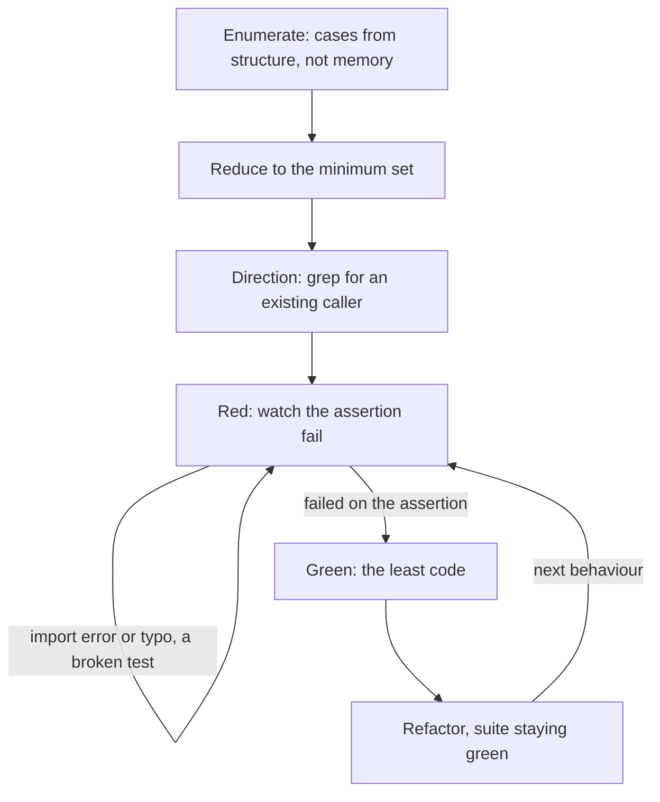

# TDD mode

One rule holds the whole mode up. No implementation line exists before a test that failed for the right reason.

Everything below exists to make that rule mean something. Written loosely it degrades into writing a test at some point, which is ordinary practice and needs no mode. Written tightly it forces three decisions before the first assertion and one discipline inside every lap.

## When it starts and when it ends

`enter-when` matches somebody asking for the discipline by name. The alternatives are the term of art and the phrases people actually type, and none of them is a bare `test` or `tests`. That omission is deliberate twice over. "The tests fail" is a symptom report, which is debugging work rather than this. "Add tests for the parser" may be a backfill over code that already works, which is useful but is not this either.

`exit-when: manual`, so only `/mode off` ends it. One session usually carries several behaviours, and a contract that cleared itself on the first green would leave every later lap unprotected.

## The shape of it

The three gates run once per behaviour; the lap at the bottom runs until the behaviours run out.

## The three gates, then the cycle

Enumerate, Reduce and Direction happen once per behaviour, in that order, before a single test is written. Then the cycle runs.

### 1. Enumerate

Do not list cases from memory. Induct on the structure of the behaviour, along these five axes.

- **What grows.** Name the quantity that gets larger with each step: items in the list, depth of the tree, number of retries, bytes buffered. Then write the base case where it is zero and the step that takes n to n plus one.
- **Degenerate cases.** Empty, exactly one, absent, the maximum, and the value one past the maximum. Anything a loop can run zero times.
- **Preconditions of each transition.** For anything with states, every edge has something that must be true before taking it is legal. Each edge earns two cases: taken when it should be, refused when it should not.
- **Termination.** What stops the loop, and what happens when the stopping condition never arrives.
- **Out-of-domain events.** The input nobody planned for, arriving in the state nobody planned for. A cancel during a retry. A second call before the first one returned.

If this setup carries an edge-induction skill, this is the gate that loads it.

### 2. Reduce

An exhaustive list is not yet the list you write. Two cases that drive the same branch to the same observable outcome collapse into one test.

Observable outcome means what a caller can see: the return value, the error raised, or a side effect that got recorded. Internal state no caller can reach does not count and does not deserve a test.

The reason is cost. A suite hitting one branch nine different ways costs nine times the maintenance and catches the same single bug. Keep the case that reads clearest, drop the rest, and note in one line what collapsed into what, so the coverage claim stays honest.

The list you finish with is the minimum set. Exhaustive was the input, not the target.

### 3. Direction

Outside-in or inside-out, and the deciding question is whether the contract is already frozen. One grep for an existing caller of the identifier answers it.

| The grep finds | The contract is | Go | Because |
|---|---|---|---|
| Nothing | Not fixed yet | Outside-in | The test names the interface before it exists, so the design pressure lands on the signature while moving it is still free. |
| A caller | Frozen | Inside-out | Somebody already depends on this shape, so real objects beat mocks. A mock of a frozen contract only re-asserts what you already believe. |

Say which direction you took and what the grep found. That one sentence is what lets the choice be argued with later.

### 4. Red, Green, Refactor

One behaviour per lap. A lap covering three behaviours has three chances to go green for the wrong reason.

- **Red.** Write the test, run it, and read the failure. It has to fail on the assertion.
- **Green.** The least code that turns it green. Not the general version and not the elegant one. Generality that arrives before a second case is a guess wearing a pattern's name.
- **Refactor.** With the suite green, clean up. No new behaviour arrives in this step. A new behaviour needs a new red first.

## What red actually means

This is the sentence the mode lives or dies on, so it gets its own section.

**Red means the assertion fired.** A test that dies on an import error, a missing fixture, a syntax error or a typo in a name is broken rather than red. It proves the file does not run, which was never in question.

Read the failure text before writing a line of implementation. A `ModuleNotFoundError`, a `NameError` on the test's own scaffolding, or a collection error means you have a broken test. Fix it and run again. Only an assertion message describing the behaviour you meant to pin counts as the gate being passed.

A test that passes on its very first run is also not red. Either the behaviour already exists, in which case find out what the test is really asserting, or the assertion is vacuous and pins nothing at all.

The failure message is part of the test. A stranger reading only that line should learn what broke, so `assert result == 3` is worse than a message naming the behaviour.

## What changes, turn to turn

| Ordinarily | In this mode |
|---|---|
| A test is written once the code works | No implementation line exists before a test that was watched failing |
| Cases come to mind while writing | Cases come from a structured pass, then get reduced to the minimum set |
| Mocks stand in for whatever is inconvenient | Direction is decided first, and a frozen contract gets real objects |
| "The tests pass" | "It failed on the assertion with this message, then passed" |
| Refactoring and new behaviour ride in together | Refactoring happens green, and new behaviour needs a new red |

## A hook enforces this

The `no-code-without-red` flag in the front matter above arms a guard, and the guard refuses the edit rather than reminding you about it. Writing the implementation first is not discouraged here. It is denied.

What the guard watches is narrow and worth knowing exactly.

| It judges | It never judges |
|---|---|
| A file whose extension carries behaviour, in a directory that is not a test one | Markdown, JSON, YAML, CSS, fixtures, anything the rule was never about |
| A file whose name is not test shaped | A test file, wherever it lives, so the test is always writable |

It opens on one condition: a suite the recorder watched exit non-zero, with no passing run recorded after it. That is the red the mode already asks for, read off the run rather than off a claim. A green closes the lap, and the next implementation edit waits for a new red.

Three things follow, and each is deliberate.

- **The guard cannot see why a run failed.** An import error exits non-zero and opens the gate, so the sentence below about what red means is still yours to keep. The mechanism stops the common failure, which is skipping the test entirely; it does not certify the assertion fired.
- **The test file is never refused.** You can always write, fix and rerun the test, which is the only way to reach a red in the first place.
- **It can be switched off.** `"guards": "off"` in `~/.claude/mode/config.json` disarms every guard at once, and `/mode off` ends the mode. Neither is a loophole to reach for mid lap. Both exist so a rule that is wrong for this repo can be dropped out loud rather than worked around.

`mode why` prints whether the gate is open right now and what would open it.

## Standing reminder

- No implementation line before a test you watched fail for the right reason.
- Red is the assertion firing. An import error or a typo is a broken test, not a red one.
- Enumerate the cases, reduce to the minimum set, pick a direction and say which.
- A guard refuses the edit while no red stands. Say which lap you are on, and quote the red.
